

  <h1>🍕 Mi Gusto — WebApp Gastronómica Premium</h1>
  
<strong>Experiencia visual, innovación tecnológica y storytelling digital al servicio de la marca.</strong>

  

    
    
    
    
    
    
  

---

## ✨ Visión & Experiencia de Usuario

Plataforma *cross-device* de vanguardia concebida para la gestión, visualización y promoción de productos, franquicias, sucursales y talento. Todo el desarrollo e interfaz combinan estética moderna con interacciones fluidas para ofrecer una experiencia memorable.

### 🌟 Pilares Destacados

- 🎨 **Glassmorphism & Diseño Premium:** Paneles traslúcidos con efectos de desenfoque, degradados armónicos y tipografía contemporánea.
- ⚡ **Animaciones de Alto Rendimiento:** Scroll reveals, transiciones suaves e integraciones dinámicas mediante **GSAP** y **Framer Motion**.
- 📐 **Mobile-First Real:** Arquitectura adaptativa orientada al uso táctil, con navegación fluida y rápida en cualquier dispositivo.
- 🥟 **Experiencia 3D & Flipbook:** Visualización tridimensional interactiva de productos clave (`model-viewer`) y catálogo estilo revista digital (`react-pageflip`).
- 📋 **Formularios Dinámicos:** Gestión eficiente para franquicias, proveedores, RRHH y contacto directo con validación inmediata.

---

## 📸 Galería de Interfaz

  <table>
    <tr>
      <td width="50%">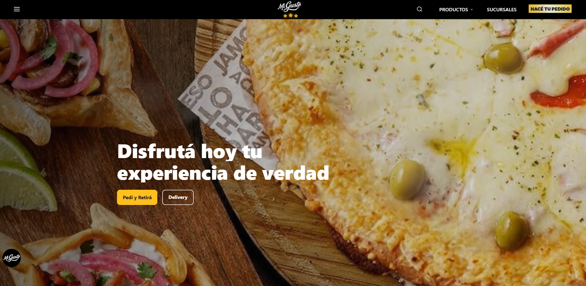</td>
      <td width="50%">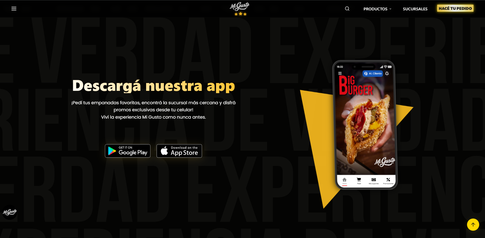</td>
    </tr>
    <tr>
      <td width="50%">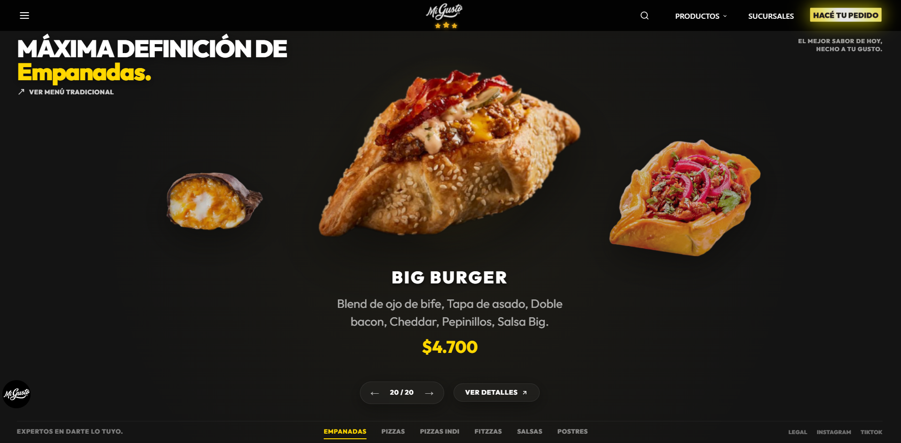</td>
      <td width="50%">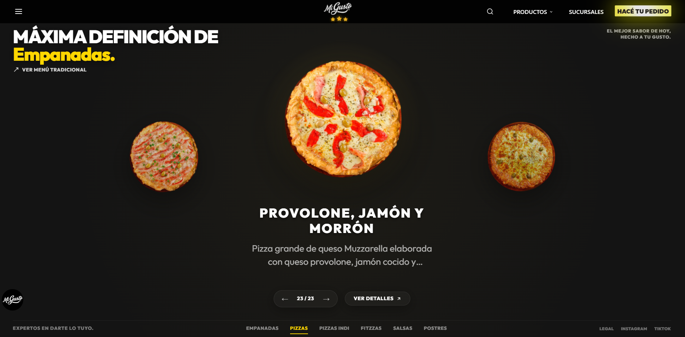</td>
    </tr>
    <tr>
      <td width="50%">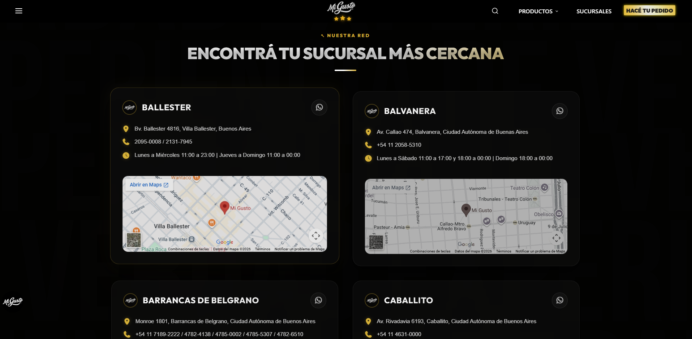</td>
      <td width="50%">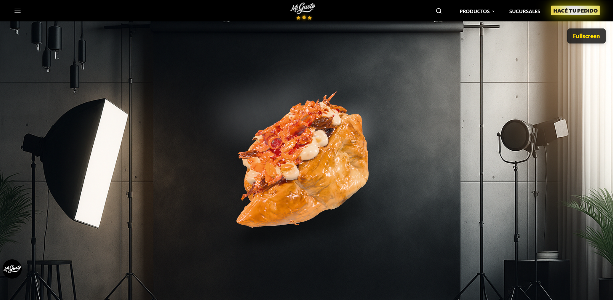</td>
    </tr>
    <tr>
      <td width="50%">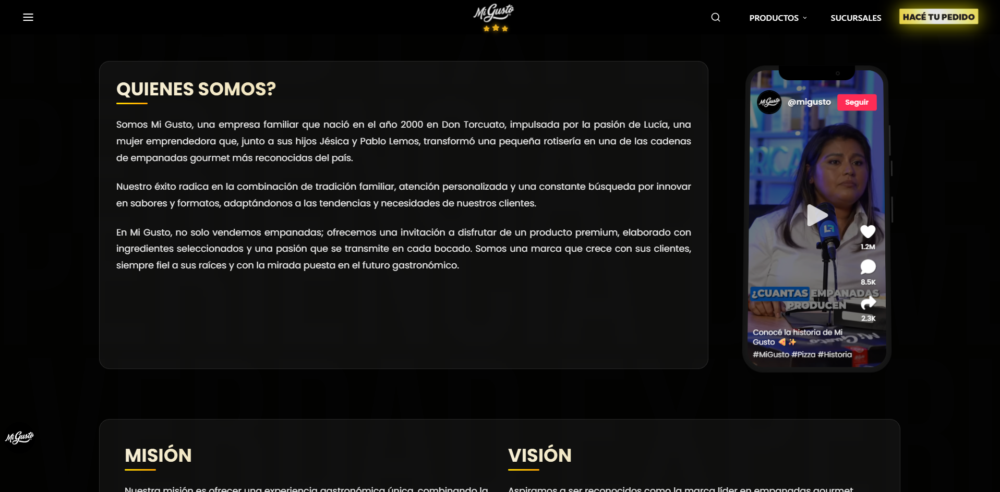</td>
      <td width="50%">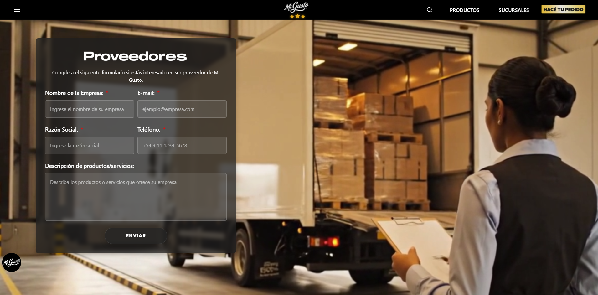</td>
    </tr>
    <tr>
      <td width="50%">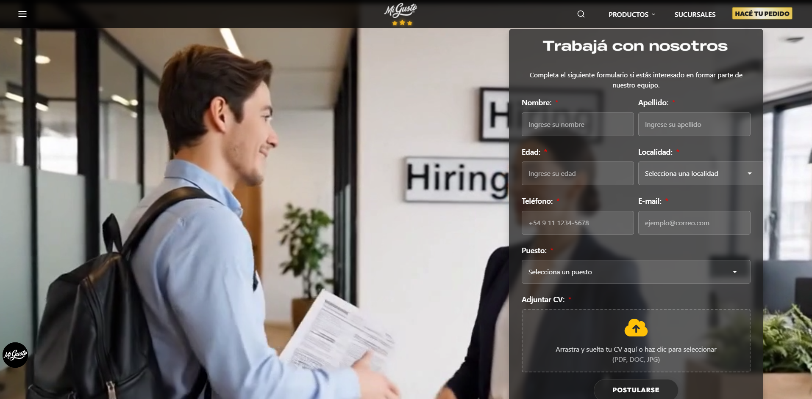</td>
      <td width="50%">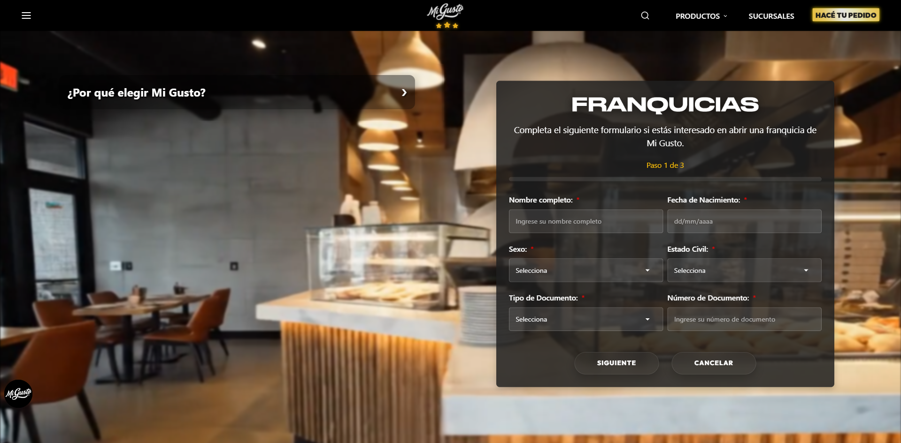</td>
    </tr>
  </table>

   

  <table width="100%">
    <tr>
      <td align="center">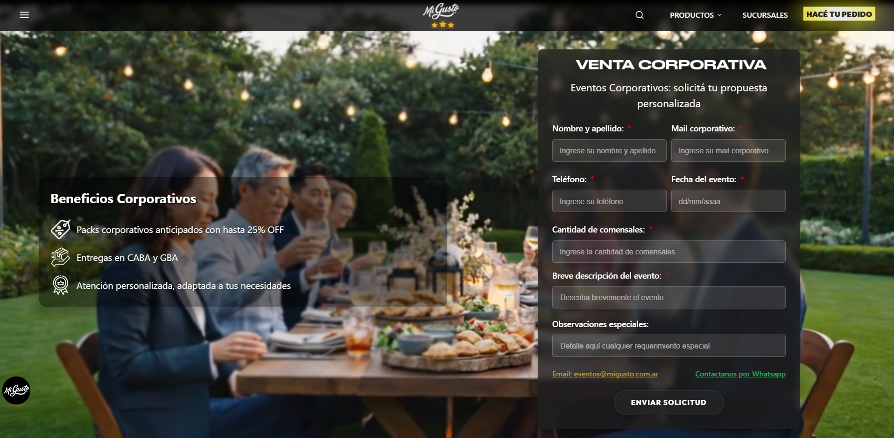</td>
    </tr>
  </table>

---

## 🛠️ Tecnologías y Librerías

- **Core:** React 19, TypeScript, Vite
- **Estilos y UI:** Tailwind CSS, CSS Modules, Lucide Icons, FontAwesome, Bootstrap
- **Animaciones & 3D:** GSAP, Framer Motion, ScrollReveal, Model-Viewer
- **Interacciones & Multimedia:** React PageFlip, Swiper, SweetAlert2, React Medium Image Zoom
- **Integraciones:** EmailJS, Mailchimp, Nodemailer

---

## 👥 Equipo y Agradecimientos

- [**Facundo Carrizo**](https://github.com/Facu14carrizo) — *Desarrollo & Arquitectura*
- [**Ramiro Lacci**](https://github.com/ramirolacci) — *Desarrollo & Arquitectura*
- [**Joaquín Tonizzo**](https://github.com/JoaquinTonizzo) — *Colaborador*

> *Un agradecimiento especial a toda la organización Mi Gusto por su confianza y visión a futuro.*

  © Equipo de Sistemas — Mi Gusto

